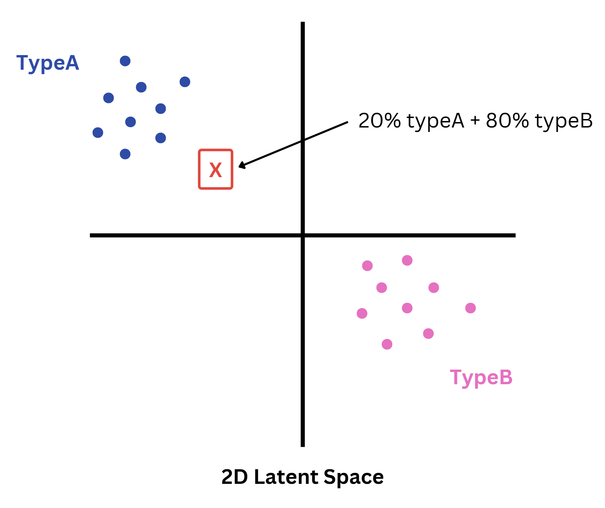

# **Enhancing Image Classification with VAE-Generated Hybrid Datasets**

This project aims to develop an new approach to improve the performance of Convolutional Neural Networks (CNNs) for image classification by using Variational Autoencoder (VAE)-generated hybrid datasets. The hybrid datasets combine features from different classes in a single image, which helps the CNN improve the classification accuracy.

## **Motivation**

Traditional CNN-based image classification relies on datasets where each training image belongs to a single, distinct class (e.g., "CAT" or "DOG"). However, this project introduces a new method where images are generated with mixed features from multiple classes (e.g., "20% CAT + 80% DOG") to train a CNN. By training on these hybrid datasets, the model learns richer, because of the more complicated training data, leading to improved classification performance.

## **How It Works**

### **1. Latent Space Creation Using VAE**
- A VAE is trained on the original dataset to encode images into a compressed latent space.
- In the latent space, similar images are grouped closer together, forming clusters for each class (e.g., "CAT" and "DOG").

### **2. Generating Hybrid Images**
- A random point is chosen in the latent space.
- The likelihood of the point belonging to each class is calculated.
- The point is decoded to generate a hybrid image (e.g., "20% CAT + 80% DOG"), which combines features from multiple classes.

### **3. CNN Training with Hybrid Data**
- The hybrid images, along with their class likelihoods, are used as training data for a CNN.
- The CNN learns to classify images with increased accuracy due to the richer feature representations in the hybrid dataset.

## **How to Calculate the Percentage of a Point in Latent Space**

Below is a visualization of the latent space, where each cluster represents a class (e.g., TypeA and TypeB). These clusters are formed by encoding the original data into the latent space using the encoder of the VAE. A randomly selected point (`X`) is evaluated for its likelihood of belonging to each class. The decoded image is then labeled with these likelihoods and used for CNN training.

    

- **Step 1**: Randomly pick a point in the latent space.
- **Step 2**: Calculate the likelihood of the point belonging to each class (e.g., "20% TypeA + 80% TypeB").
- **Step 3**: Decode the point to create a new hybrid image.

(Mathematics behind this still in progress)

## **Brief Step-by-Step Algorithm**

1. **Train the VAE**:
   - Train a Variational Autoencoder on the original dataset to create the latent space representation.
2. **Analyze the Latent Space**:
   - Encode the original dataset into the latent space to observe the clustering of each class.
3. **Sample Points from the Latent Space**:
   - Randomly sample points in the latent space.
   - Calculate the likelihood of each point belonging to specific classes based on its proximity to class clusters.
4. **Generate Hybrid Images**:
   - Decode the sampled points into images.
   - Label the images with their class likelihoods (e.g., "20% CAT + 80% DOG").
5. **Train the CNN**:
   - Use the hybrid dataset (generated images and their likelihoods) to train a CNN for classification.
6. **Compare to traditional CNN**
   - Compare the results of the new approach to the traditional one by visualizing the relation between the number of training data and the accuracy of the image classification. 

## Requirements

The following libraries are required for this project. The versions listed below are the ones used during development:

1. `pandas` 2.2.3
2. `numpy` 1.26.4
3. `torch` 2.6.0+cpu
4. `torchvision` 0.21.0+cpu
5. `matplotlib` 3.10.1